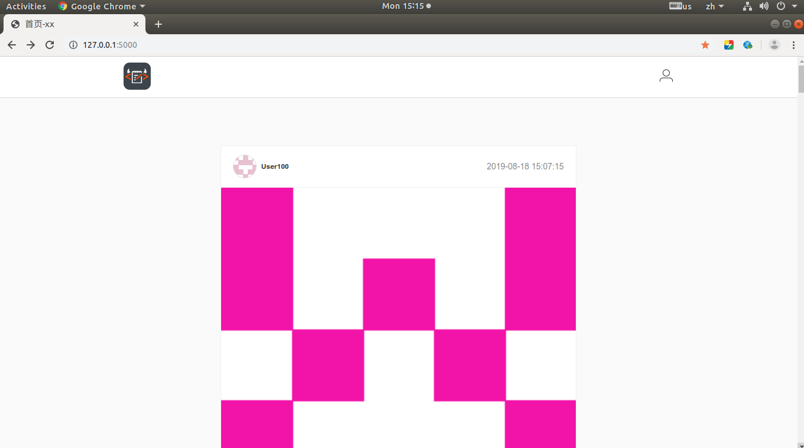
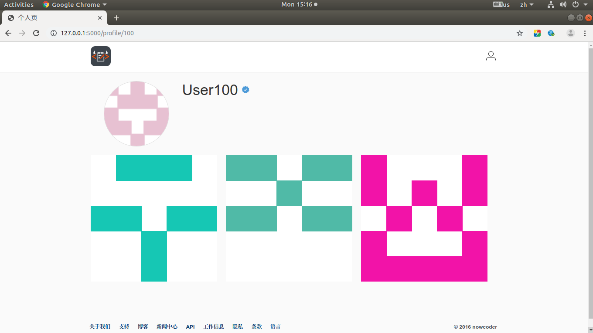
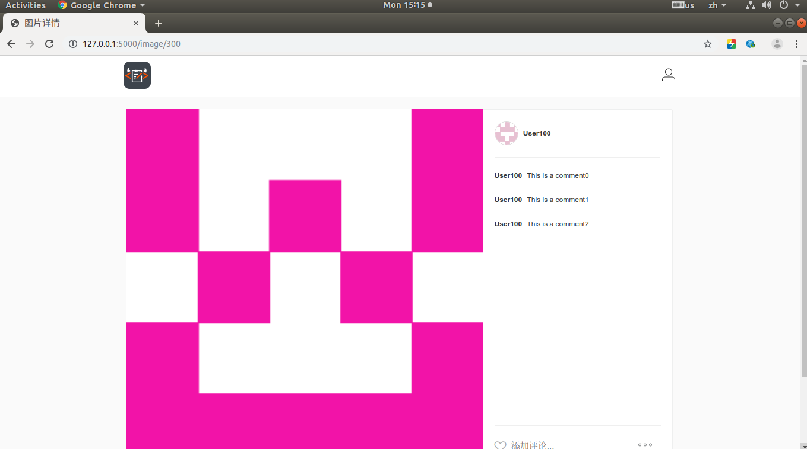

# myinstagram

- 简介
- 功能页面展示
- 部署
- 可扩展功能
- 可深度技术计数
## 简介：
这是一个模仿Instagram的个人图片分享网站，网站的目的主要数实现个人的注册和登录功能实现图片的在线分享，点赞和对图片进行评论。

## 功能页面展示
### 登录注册页面


用户可以这这里先登录，登录成功之后会自动跳转到系统主页面，如果是已经注册且退出的用户就可以直接登录，然后跳转到网站的主页面。
### 网站主页展示


用户可以在这里浏览网站的图片，图片可以是自己的也可以是其他人的，主要使用动态加载的方式加载，点击底部的更多按钮会使用js动态加载出来，但是这个功能需要在后期完善
### 个人详细页面展示


用户在首页点击对用的用户头像之后会跳转到用户的个人信息页面，但是如果是没有登录的用户就会跳转到用户登录的页面，需要先登录才能访问。
### 图片详细页面展示


用户在系统的首页点击图片之后会跳转到图片的详情页面，登录的用户可以对图片进行评论。
## 使用gunicorn+Nginx部署方法
需要一台Linux服务器，先在系统上安装下面的模块：
```markdown
服务器
apt-get install nginx mysql-server gunicorn3 python-flask libmysqlclient-dev python-dev
依赖包
pip3 install Flask-Script Flask-SQLAlchemy Flask-Login qiniu Flask-MySQLdb
```
启动服务器：
`gunicorn3 –D –w 2*core+1 –b 127.0.0.1:8000 myinstagram:app`

然后配置Nginx，打开其配置文件的位置：
`/etc/nginx/sites-enabled/c1`

然后进行Nginx 配置，虚拟服务器：
```markdown
server {
    listen 80;
    server_name c1.myinstagram.com;
    location / {
        proxy_pass http://127.0.0.1:8000;
    }
}
``` 


## 项目可扩展功能

此项目可以扩展有：
- 1.用户注册，邮箱激活流程
- 2.首页滚动到底部自动加载更多
- 3.管理员后台删图
- 4.每日推荐图片首页置顶
- 5.导购小尾巴，图片内嵌广告（smzdm.com）

技术深度扩展
- 1.邮件发送
- 2.记录PV、热度排序
- 3.缩图服务
- 4.爬虫自动填充图片

